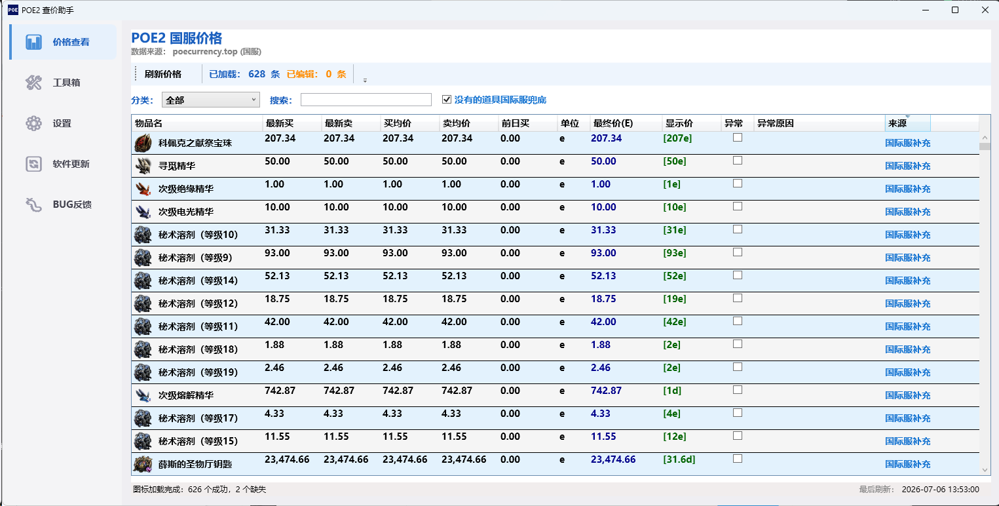
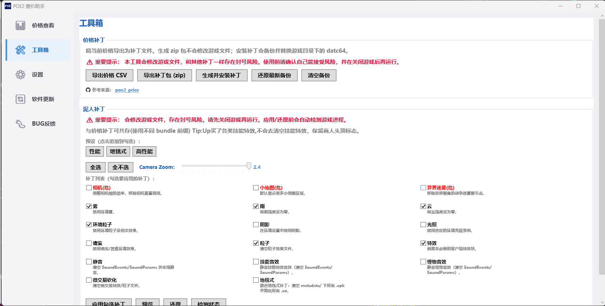

## Poe2PriceGui-介绍

```
POE2 物价补丁GUI版本: 为《Path of Exile 2》国服自动抓取通货物价，查询装备价值工具(实时物价指的是打入补丁那一刻的物价，刷新物价需要自己手动更新，也就是得重新打补丁。)。

注: 本工具仅用于学习和研究，不涉及任何商业用途。

工具目前还是一个Alpha版本，可能会有BUG和不完善的地方。

BUG反馈可以加QQ群反馈: 1001850913
```

价格补丁部分参考自开源项目 [weixiao030/poe2\_price](https://github.com/weixiao030/poe2_price)，在此致谢。

查价器部分参考自开源项目 [maxensas/xiletrade](https://github.com/maxensas/xiletrade)，在此致谢。

泥人补丁逻辑部分参考自开源项目 [kengzzzz/tiny-poe2smoother](https://github.com/kengzzzz/tiny-poe2smoother)，在此致谢。

***

> ⚠️ **重要提示：** 本工具会修改游戏文件，和其他补丁一样**存在封号风险**。使用前请确认自己能接受风险，并在**关闭游戏后**再运行。
>
> API Token 用于访问更稳定的 \_validate API 和查询完整历史价格数据(国服可以理会一下，国际服无需理会)。
>
> 当前可使用限免30天的API KEY（2026-07-15 23点到期）: 789486ce3baf2c4a7e18f4ba0b9aa4ab8edb9da64ca92bca10ca74c094cd8f8d
>
> 如果超过7月15日，请将设置中的API Token删除，走原始API, 后续会针对性的优化价格计算。

***

## 使用方法

```
例:
国服:D:\WeGameApps\rail_apps\流放之路：降临(2002052)
国际服:E:\pathofexite2

游戏道具价格显示:
设置-游戏目录(优先点击自动选择，如果不可以手动复制目录过来)-等待下方检测(显示国服或国际服目录，则成功)-价格查看-刷新价格-工具箱-生产补丁并安装

查价器:
设置-查价器-点击登录-点击开关-默认热键(ctrl+d)

Tip:
国服如果提示各种上不去游戏的错误，请检查游戏是否使用过其他补丁，如使用过请先修复游戏，修复游戏后还是无法使用，并且之前启动过其他腾讯国服游戏，请重启电脑后再试。
```

## 更新日志

```
v1.0.9
1.取消tools里各种工具的需求，将所有功能都移植到代码里(优化软件硬盘占用)。
2.取消价格显示里，残留的游戏语言识别翻译表。
3.新增特新(新)和特效(精准)模式，均为测试模式。
4.调整UI布局，移除冗余的提示文本块
5.优化一下价格连续错误时的问题。
6.优化一下steam服务器的支持(未测试)。
7.完善异常捕获与启动日志追踪，修复图标加载容错
8.调整部分补丁描述与路径匹配规则，优化代码结构
9.优化看板网SSL掉了的的问题，取消SSL验证。

v1.0.8
1.修复无法获取道具的问题。
2.移出BundleExtractor.exe的使用，直接将代码移植进来，新增GGPK模式补丁工具。
3.添加lib支持库目录。
4.国际服兼容完善，目前价格补丁，泥人补丁均已兼容国际服(查价器目前得等国服的完善才跟进国际服)。
5.重构用户数据存储路径，将日志、缓存、配置等迁移至LOCALAPPDATA避免升级丢失
6.支持多语言检测与分离登录Cookie
7.修复道具识别问题，更新中文资源文本
8.优化翻译表加载与生成逻辑，支持简繁双翻译表(查询价格道具显示)

v1.0.7
1.国服没有的道具添加国际服价格兜底功能。
2.优化泥人补丁界面，开放更多功能(红色为高危功能不建议使用)。
3.优化net 8.0错误,将net8.0一起打包出去。
4.优化泥人特效处理的时候，保留一些机制玩的特效(恢弘之境，惊悚迷雾，地面特效等)。
5. 新增物品名翻译系统，支持多语言界面
6. 完善游戏语言检测与路径适配逻辑
7. 优化道具数据来源标识与UI展示
8. 补充多项本地化文本翻译

v1.0.6
1.优化更新错误提示。
2.优化无Token下价格计算方式,采取一天的中位数进行使用。
3.添加泥人画质优化补丁功能，支持性能/毯式/全量三种预设
4.修复.NET10/11 SDK构建WPF项目的重复AssemblyInfo错误
5.优化价格正则匹配与变体生成逻辑，支持带方括号的价格格式
6.新增Oodle压缩解压P/Invoke封装
7.支持物价补丁增量更新，保留已有自定义bundle记录，兼容更多游戏补丁
8.新增文本块解析工具类，支持游戏配置文件修改
9.xiletrade中的library项目，用于处理物品数据解析完全移植过来，并且优化国服字段兼容能力
10.新增查找、判断、切换POE2游戏窗口的工具方法
11.复制装备文本前自动切换到游戏窗口，提升使用体验
12.打开叠加层前自动关闭旧弹窗，避免重复遮挡
13.设置叠加层不抢占焦点，保证游戏前台运行
14.优化查价器词条显示界面

v1.0.5(国际服支持还未完善，未测试)
1. 新增物品品质、护甲、闪避、能量护盾、伤害等属性字段
2. 重构剪贴板复制逻辑，修复输入法兼容问题
3. 新增多种测试用例，支持多类型物品测试
4. 重构搜索字段生成逻辑，支持更多筛选条件
5. 优化赛季选择功能，支持动态获取并校验赛季列表
6. 重构稀有度颜色转换器，兼容多语言与旧版用法
7. 优化悬浮窗UI样式与物品信息展示
8. 新增IPriceService接口抽象价格服务，实现国服poecurrency.top与国际服poe2scout.com双数据源
9. 重构主视图模型，支持自动检测区服、强制切换区服调试功能
10. 新增登录浏览器窗口，适配国际服登录流程
11. 优化交易服务，支持国服/国际服不同API地址与请求头
12. 新增图标直接URL加载逻辑，适配国际服图标获取
13. 新增GGPKExtractor工具与国际服GGPK模式还原逻辑
14. 修复部分UI绑定与状态同步问题
15. 优化备份逻辑
16. 大幅度优化查价器搜索速度(提升3倍以上)

v1.0.4
1.添加清空备份功能。
2.添加安全提示。
3.添加一个未鉴定装备的查价器测试，修复一个查价器错误。

v1.0.3
1.修复查价器登录部分问题(暂时改为手动登录，取消自动登录)。
2.取消设置页面最下方提示。

v1.0.2
1.添加自动更新功能,使用Github Releases更新。

v1.0.1
1.添加除github外的BUG反馈途径。
2.优化readme，添加简易使用方式。

v1.0.0
1.添加GUI界面管理(主界面表格内价格支持手动修复)。
2.获取国服价格方式添加最新过滤异常价格的API(目前已内置最新的API接口，和免费30天试用版的Token, summary_validate接口)。
3.显示优化为1D以下显示为E的单位,1D以上显示为D的单位,低于1E的不显示价格。
4.添加日志系统，记录工具运行时的事件和错误信息。
5.添加查价器功能。

```

## 打包命令

```
old:
dotnet publish -c Release -r win-x64 --self-contained true -p:DebugType=none -p:DebugSymbols=false

new:
1. 安装 vpk CLI 工具（仅需一次）
dotnet tool install -g vpk
2. 发布应用
dotnet publish Poe2PriceGui.csproj -c Release --self-contained -r win-x64 -o .\publish
3. 用 vpk 打包 Velopack 发布包
vpk pack --packId Poe2PriceGui --packVersion 1.0.2 --packDir .\publish --mainExe Poe2PriceGui.exe

```

## 界面预览

***

|            主界面            |           工具箱-补丁           |           游戏效果          |
| :-----------------------: | :------------------------: | :---------------------: |
|  |  |  |

|           游戏效果           |           游戏效果           |
| :----------------------: | :----------------------: |
|  |  |

|            查价器-道具           |            查价器-价格           |             查价器-道具提示            |
| :-------------------------: | :-------------------------: | :-----------------------------: |
|  |  |  |

***

## ⭐ Star 历史

<picture>
  <source media="(prefers-color-scheme: dark)" srcset="https://api.star-history.com/svg?repos=john-worker/Poe2PriceGui&type=Date&theme=dark" />
  <source media="(prefers-color-scheme: light)" srcset="https://api.star-history.com/svg?repos=john-worker/Poe2PriceGui&type=Date" />
  
</picture>
